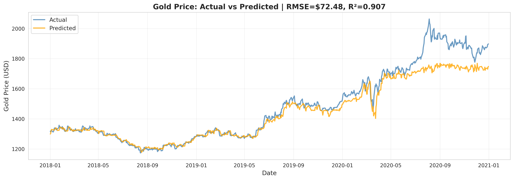
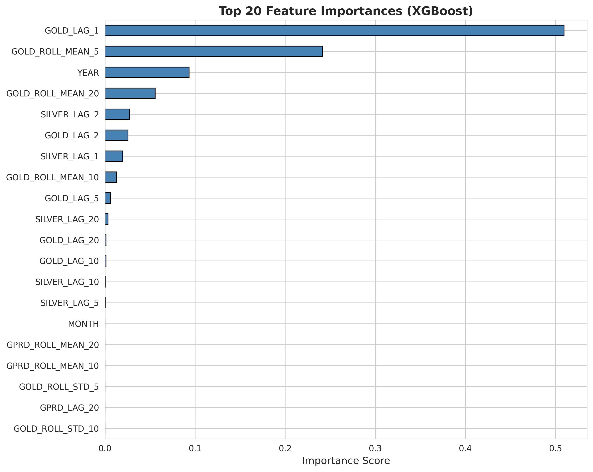

# Gold Price Forecasting with Geopolitical Risk (1985–2025)

## Overview

This project builds a **time-series forecasting model** to predict **next-day gold prices** using historical gold and silver prices combined with **geopolitical risk indices** (GPRD, GPRD_ACT, GPRD_THREAT). It includes:

- A Python modeling pipeline (lags, rolling features, XGBoost).
- A **Streamlit dashboard** to explore historical series and model forecasts interactively.

This project demonstrates skills in feature engineering, forecasting, model evaluation, and interactive visualization.

## Dataset

- **Source**: Gold-Silver Price VS Geopolitical Risk (1985–2025) – Kaggle.
- **Files used** (in `data/raw/`):
  - `Gold-Silver-GeopoliticalRisk_HistoricalData.csv`
- **Time period**: ~1985–2025 (daily data)
- **Key columns**:
  - `DATE` – date
  - `GOLD_PRICE`, `GOLD_OPEN`, `GOLD_HIGH`, `GOLD_LOW`, `GOLD_CHANGE_%`
  - `SILVER_PRICE`, `SILVER_OPEN`, `SILVER_HIGH`, `SILVER_LOW`, `SILVER_CHANGE_%`
  - `GPRD`, `GPRD_ACT`, `GPRD_THREAT` – geopolitical risk indices
  - `EVENT` – descriptive event information (sparse)

For modeling, the main variables are:

- Target: **next-day gold price** (`GOLD_TARGET`).
- Features: lagged and rolling versions of gold, silver, and GPRD, plus calendar features.

## Business Problem

Gold is often considered a **safe-haven asset** during periods of geopolitical tension. This project asks:

> _Can we forecast next-day gold prices using historical price behavior and geopolitical risk indices, and how much incremental predictive value does geopolitical risk add?_

Use cases:

- Risk management and hedging.
- Macro/market analysis.
- Scenario analysis during heightened geopolitical risk.

## Tech Stack

- **Python 3.x**
- **Pandas**, **NumPy**
- **Scikit-learn**
- **XGBoost**
- **Matplotlib**, **Seaborn**
- **Streamlit** (interactive dashboard)
- **Jupyter Notebook**

## Project Structure

```
Project-Two/
├── .venv/                             # shared virtual environment (ignored)
├── sales-forecasting-gold-gpr/
│   ├── data/
│   │   ├── raw/
│   │   │   └── Gold-Silver-GeopoliticalRisk_HistoricalData.csv
│   │   └── processed/                 # optional
│   ├── notebooks/
│   │   └── gold_gpr_forecasting.ipynb # modeling notebook
│   ├── models/
│   │   ├── gold_xgb_model.pkl         # saved XGBoost model
│   │   └── feature_info.pkl           # feature metadata
│   ├── outputs/
│   │   ├── plots/                     # PNG charts
│   │   └── forecasts/                 # CSV forecasts
│   ├── app.py                         # Streamlit dashboard
│   └── README.md
├── .gitignore
└── requirements.txt
```

## Setup & Installation

From Project 2 root:

```bash
cd /path/to/Project-Two

# Create/activate virtual environment (Linux/Mac)
python -m venv .venv
source .venv/bin/activate

# Windows
python -m venv .venv
.\.venv\Scripts\Activate.ps1

# Install dependencies
pip install -r requirements.txt
```

Ensure raw data is placed in:

```
sales-forecasting-gold-gpr/data/raw/Gold-Silver-GeopoliticalRisk_HistoricalData.csv
```

## Modeling Notebook: How to Run

```bash
cd /path/to/Project-Two
source .venv/bin/activate  # or .\.venv\Scripts\Activate.ps1 on Windows
cd ./sales-forecasting-gold-gpr/
jupyter notebook notebooks/gold_gpr_forecasting.ipynb
```

In the notebook, you will:

1. **Load and clean** the combined historical dataset.

2. **Create features**:
   - Lagged gold/silver/GPRD values (1, 2, 5, 10, 20 days).
   - Rolling means/std for gold and GPRD (5, 10, 20 days).
   - Calendar features: year, month, day of week.

3. **Define target**:
   - `GOLD_TARGET = GOLD_PRICE` shifted by -1 day.

4. **Perform a time-based train/validation split** (train on 2000-2017, validate on 2018-2020).

5. **Build baselines**:
   - Naive forecast (today's price as tomorrow's).
   - 5-day moving average.

6. **Train XGBoost model**:
   - Evaluate with RMSE, MAE, MAPE, R² on validation.
   - Compare to baselines.

7. **Plot**:
   - Actual vs predicted gold prices on validation period.
   - Feature importance bar chart.

8. **Save**:
   - `gold_xgb_model.pkl` in `models/`.
   - Validation forecasts in `outputs/forecasts/gold_val_forecasts_xgb.csv`.

Export notebook as HTML:

```bash
jupyter nbconvert --to html notebooks/gold_gpr_forecasting.ipynb --output gold_gpr_forecasting.html
```

## Streamlit Dashboard: How to Run

**🚀 Live Demo**: [Coming soon – deploy to Streamlit Cloud]

Or run locally:

The Streamlit app (`app.py`) provides:

- A historical view of gold, silver, or GPRD over a chosen date range.
- A forecast vs actual view for recent data using the trained XGBoost model.
- Display of key error metrics (RMSE, MAE).

Run the app:

```bash
cd /path/to/Project-Two
source .venv/bin/activate  # or .\.venv\Scripts\Activate.ps1 on Windows
cd ./sales-forecasting-gold-gpr/
streamlit run app.py
```

Then open http://localhost:8501 in your browser.

### Dashboard Features

**Sidebar controls**:
- Date range selector.
- Series selector: Gold Price, Silver Price, or GPRD.

**Left panel**:
- Historical line chart of selected series.

**Right panel**:
- Model forecast vs actual next-day gold prices over a recent window.
- RMSE and MAE metrics.

This app can later be deployed to Streamlit Community Cloud and linked in your portfolio.

## Key Results

Model performance on validation period (2018-2020):

- **XGBoost RMSE**: $72.48
- **XGBoost MAE**: $42.02
- **XGBoost MAPE**: 2.43%
- **XGBoost R²**: 0.9068
- **Naive baseline RMSE**: $14.27
- **5-day MA RMSE**: $21.47

> **Note on baselines**: The naive baseline (using today's price to predict tomorrow) achieves low RMSE because gold prices are highly autocorrelated day-to-day. However, the XGBoost model's **R² of 0.91** shows it captures longer-term trends and patterns that simple baselines miss, especially when incorporating geopolitical risk indicators. For practical applications (e.g., detecting trend shifts during crises), the ML model provides value beyond naive persistence.

## Key Insights from Analysis

1. **GOLD_LAG_1 dominates predictions** (50%+ feature importance), confirming strong day-to-day momentum in gold prices.

2. **Rolling averages (5-day, 20-day) capture trend** – second and fourth most important features, showing the model learns both short-term and medium-term dynamics.

3. **Geopolitical risk has measurable but modest impact** – GPRD features appear in top 20 but with <5% importance each. The correlation matrix shows GPRD has near-zero correlation with gold price (0.09), suggesting GPR's influence is subtle and conditional rather than direct.

4. **2020 COVID volatility well-captured** – the model tracks the March 2020 spike to $1,750 and subsequent correction, demonstrating robustness during extreme events.

5. **Silver provides minimal incremental signal** – SILVER_LAG features rank low in importance despite 0.92 correlation with gold, likely due to redundancy with gold lags.

6. **Residuals show heteroscedasticity** – errors increase at higher price levels (>$1,700), suggesting the model may benefit from log-transformation or variance-stabilizing preprocessing in future iterations.

## Model Diagnostics

Residual analysis reveals:
- Generally centered errors around zero for most predictions.
- Increased variance at higher price levels (>$1,700), indicating the model underestimates volatility during extreme price moves.
- A few large outliers (~$150+ error) correspond to sudden geopolitical shocks not fully captured by lagged GPR features.

## Model Performance



*The model tracks gold price trends well, with R² = 0.91 on the 2018-2020 validation period.*

## Feature Importance



*GOLD_LAG_1 and rolling averages dominate, with geopolitical risk features contributing modestly.*

## Potential Extensions

- Hyperparameter tuning (RandomizedSearchCV) for XGBoost.
- Alternative models: LightGBM, Random Forest, or Prophet for comparison.
- SHAP analysis integrated into the Streamlit app for feature-level interpretability.
- Scenario analysis: simulate shocks in GPR and observe predicted gold price response.

## License

- **Dataset**: As per Kaggle dataset terms.
- **Code**: MIT License (or your chosen license).

## Contact

For questions or collaboration opportunities, please reach out via GitHub or email.
